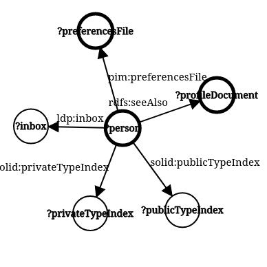

# `@ldhop/core`

LDhop - Follow your nose through Linked Data graph. This is the core engine package.

## Usage

```sh
npm install @ldhop/core --save
yarn add @ldhop/core
```

```ts
import { QueryAndStore, RdfQuery } from '@ldhop/core'
import { foaf, rdfs } from 'rdf-namespaces'

// specify the steps of the query
// in this case fetch the whole foaf social network
// and also look in extended profile documents
const friendOfAFriendQuery: RdfQuery = [
  {
    type: 'match',
    subject: '?person',
    predicate: foaf.knows,
    pick: 'object',
    target: '?person',
  },
  {
    type: 'match',
    subject: '?person',
    predicate: rdfs.seeAlso,
    pick: 'object',
    target: '?extendedProfile',
  },
  {
    type: 'add resources',
    variable: '?extendedProfile',
  },
]

// specify starting points
const initialVariables = { person: new Set([webId]) }

// initialize the walk
const qas = new QueryAndStore(friendOfAFriendQuery, initialVariables)

// now, you need to ask for missing resources, fetch them, add them to QueryAndStore
// and keep doing that until there are no missing resources left
const run = async (qas: QueryAndStore) => {
  let missingResources = qas.getMissingResources()

  while (missingResources.length > 0) {
    let quads: Quad[] = []
    const res = missingResources[0]
    try {
      quads = await fetchRdf(missingResources[0])
    } catch (e) {
      // eslint-disable-next-line no-console
      console.error(e)
    } finally {
      qas.addResource(res, quads)
      missingResources = qas.getMissingResources()
    }
  }
}

await run(qas)

// now, you have the whole RDF graph collected in qas.store, which is n3.Store
// each triple has a graph element that corresponds to the url of the document of that triple
const store = qas.store

// you can show specific variable
qas.getVariable('person')
// or all variables
qas.getAllVariables()
```

## Query

Query is an array of instructions to follow in order to discover and fetch desired Linked data.

It proceeds lazily - only requests next documents when they're needed for next steps, or if explicitly instructed.

The following steps are supported:

```ts
// step through the graph
type Match = {
  type: 'match'
  // optional constraints, either URI, or variable starting with ?
  subject?: string
  predicate?: string
  object?: string
  graph?: string
  // which of the quad components to assign to the target variable?
  pick: 'subject' | 'predicate' | 'object' | 'graph'
  // variable that results will be assigned to, starting with ?
  target: `?${string}`
}
```

```ts
// fetch documents behind variable, even if it isn't needed for next steps
type AddResources = {
  type: 'add resources'
  variable: `?${string}` // variable to fetch
}
```

```ts
// change variable, for example get container of a resource
type TransformVariable = {
  type: 'transform variable'
  source: `?${string}`
  target: `?${string}`
  // function to transform
  transform: (uri: Term) => Term | undefined
}
```

```ts
// edit the whole store in place
// this is a dangerous operation, because you can ruin the inner consistency of QueryAndStore
// don't use this unless you really really have to
type TransformStore = (qas: QueryAndStore) => void
```

### Example query: Fetch Solid WebId Profile

See [Solid WebID Profile specification](https://solid.github.io/webid-profile/#discovery) for context.

```ts
import type { RdfQuery } from '@ldhop/core'

// find person and their profile documents
const webIdProfileQuery: RdfQuery = [
  // find and fetch preferences file
  {
    type: 'match',
    subject: '?person',
    predicate: pim.preferencesFile,
    pick: 'object',
    target: '?preferencesFile',
  },
  { type: 'add resources', variable: '?preferencesFile' },
  // find extended profile documents
  {
    type: 'match',
    subject: '?person',
    predicate: rdfs.seeAlso,
    pick: 'object',
    target: '?profileDocument',
  },
  // fetch the extended profile documents
  { type: 'add resources', variable: '?profileDocument' },
  // find public type index
  {
    type: 'match',
    subject: '?person',
    predicate: solid.publicTypeIndex,
    pick: 'object',
    target: '?publicTypeIndex',
  },
  // find private type index
  {
    type: 'match',
    subject: '?person',
    predicate: solid.privateTypeIndex,
    pick: 'object',
    target: '?privateTypeIndex',
  },
  // find inbox
  {
    type: 'match',
    subject: '?person',
    predicate: ldp.inbox,
    pick: 'object',
    target: '?inbox',
  },
]
```

The query corresponds to the following picture. The resources identified by the URIs within the variables in **bold circles** are fetched while it is executed.


<!--  -->

## API

### QueryAndStore

#### creating an instance

```ts
const qas = new QueryAndStore(query, startingPoints, (store = new n3.Store()))
```

#### properties

- `store: n3.Store` - store containing RDF graph
- `query: RdfQuery` - ldhop [query](#query)

#### methods

- `getMissingResources()` - returns list of resources that still need to be fetched and added
- `addResource(uri: string, quads: n3.Quad[], status: 'success' | 'error' = 'success')` - add resource after it has been fetched - you can use [`fetchRdfDocument`](#fetchrdfdocument) function provided by this library to receive correct input for this function
- `removeResource(uri: string)` - delete resource from store
- `getVariable(variableName: string)` - get list of RDF nodes belonging to this variable
- `getAllVariables()` - get dictionary of lists of all discovered variables
- `getResources(status?: 'missing', 'added', 'failed')` - get list of resources with specific status, or all resources regardless of their status

### fetchRdfDocument

Fetch turtle document and parse it to ldhop-compatible quads

```ts
const { data } = await fetchRdfDocument(uri, fetch)
qas.addResource(uri, data)
```
